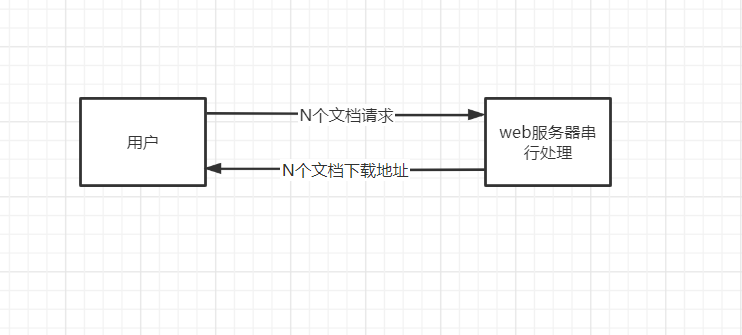
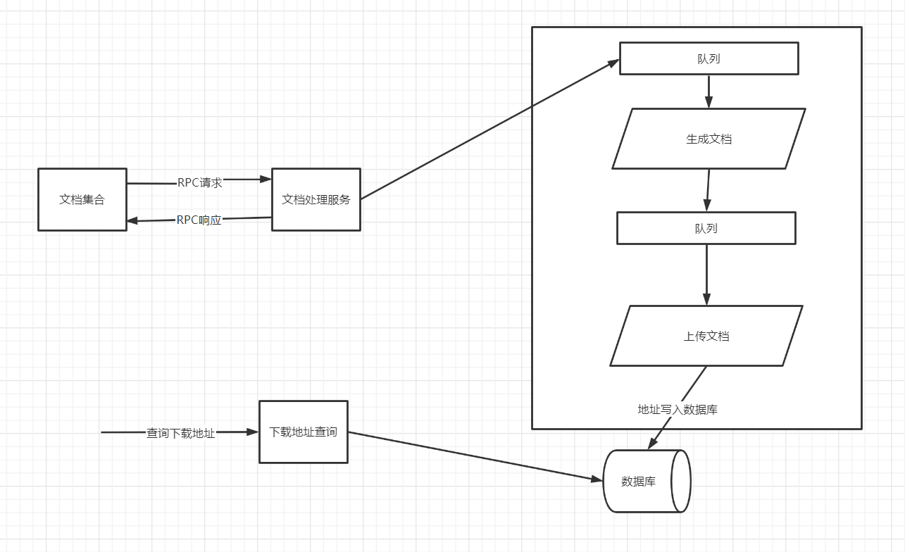
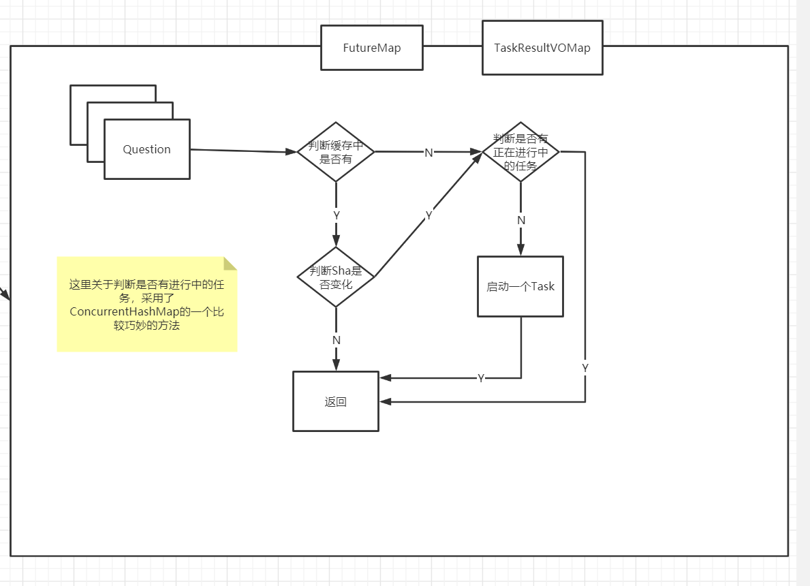

## 0.项目背景

这个项目来自为电信教育系统设计开发的一套自适应的考试学习系统，面向的用户主要是职业学院的的老师和学生以及短时间脱产学习的在职人员。什么叫自适应呢？就是当时提出一种教育理念，对学员的学习要求经常考试进行检查，学员的成绩出来以后，老师会要求系统根据每个学员的考卷上错误的题目从容量为10万左右的题库中抽取题目，为每个学员生成一套各自个性化的考后复习和练习的离线练习册。所以，每次考完试，特别是比较大型的考试后，要求生成的离线文档数量是比较多的，一个考试2000多人，就要求生成2000多份文档。当时我们在做这个项目的时候，因为时间紧，人员少，很快做出第一版就上线运营了。

当然，大家可以想到，问题是很多的，但是反应最大，用户最不满意的就是这个离线文档生成的功能，用户最不满意的点：离线文档生成的速度非常慢，慢到什么程度呢？一份离线文档的生成平均时长在50~55秒左右，遇到成绩不好的学生，文档内容多的，生成甚至需要3分钟，大家可以算一下，2000人，平均55秒，全部生成完，需要2000*55=110000秒，大约是30个小时。

为什么如此之慢？这跟离线文档的生成机制密切相关，对于每一个题目要从保存题库的数据库中找到需要的题目，单个题目的表现形式如图，数据库中存储则采用类html形式保存，对于每个题目而言，解析题目文本，找到需要下载的图片，每道题目都含有大量或大型的图片需要下载，等到文档中所有题目图片下载到本地完成后，整个文档才能继续进行处理。


有很多文档需要生成。文档中有很多题。

需要做的事情：

```
1.处理每一份文档
    对文档本身：
        1.获取所有题目，下载题目中的图片。
	处理完成后，需要将下载好的文档，处理为pdf,上传到云存储空间。
```



## 1.初版实现

初版实现，就是简单的串行处理过程。

```java
public static void main(String[] args) {
        //首先初始化题库 题目数目
        QuestionBank.initBank();
        System.out.println("题库已经初始化完成");

        // 之后根据给定的数目 生成文档  
    	// 就是生成给定数目的文档。文档中的题是随机数 范围在[60,90]
        List<DocVO> list = DocGenerate.generate(3);

        long startTotal = System.currentTimeMillis();

        // 循环遍历  之后处理
        for (DocVO docVO : list) {
            System.out.println(
                String.format("[%s]文档开始处理.共有题目: [%d]道.", docVO.getName(), docVO.getQuestions().size()));
            long startTime = System.currentTimeMillis();
            
            // 这个服务就是将 文档中的题目逐题处理(下载图片等操作),之后返回一个文件名
            // 每个题目耗时在[0.45,0.55]s左右  所以题目的处理时间在50~60s
            String localName = DocService.makeDoc(docVO);
            System.out.println(String.format("文档 %s 生成耗时, %s ms", localName, (System.currentTimeMillis() - startTime)));
            startTime = System.currentTimeMillis();
            // 将生成的题目文档上传至oss等云空间  耗时在9s左右
            String remoteUrl = DocService.upLoadDoc(docVO.getName());
            System.out.println(
                String.format("文档已上传至:%s 上传耗时, %s ms", remoteUrl, (System.currentTimeMillis() - startTime)));
        }

        System.out.println("共耗时："+(System.currentTimeMillis()-startTotal)+"ms");
    }
```

如果最开始生成一份60个文档，需要耗时多少呢？

单文档处理时间在50~60s左右，上传在9s左右。总耗时60~70s。

所有耗时在3600s~4200s。速度在60~70s / 文档


## 2.优化版本1(V1)

每个文档之间，是没有什么联系的，所以每个文档的处理，理论上是可以并行化的。



将所有的文档都投入一个线程池，让文档处理并行化起来。

设置的线程池大小是CPU处理器的数目*2。（IO密集型任务，所以线程池设置为此数目）

```java
public class RpcServiceV1 {

    private static final ExecutorService docMakeExecutorService =
        Executors.newFixedThreadPool(Constants.CORE_COUNT);

    private static final ExecutorService docUploadExecutorService =
        Executors.newFixedThreadPool(Constants.CORE_COUNT);

    // 这是完成队列。可以先获取到完成的任务
    private static final CompletionService<String> docMakeCompletionService =
        new ExecutorCompletionService<>(docMakeExecutorService);

    private static final CompletionService<String> docUploadCompletionService =
        new ExecutorCompletionService<>(docUploadExecutorService);

    public static void main(String[] args) throws InterruptedException, ExecutionException {
        //首先初始化题库 题目数目
        QuestionBank.initBank();
        System.out.println("题库已经初始化完成");
        int docCount = 6;
        // 之后根据给定的数目 生成文档
        List<DocVO> list = DocGenerate.generate(docCount);

        long startTime = System.currentTimeMillis();

        for (DocVO docVO : list) {
            docMakeCompletionService.submit(new MakeDocCallable(docVO));
        }
        System.out.println("all doc make service has submitted.");

        for (int i = 0; i < docCount; i++) {
            Future<String> future = docMakeCompletionService.take();
            docUploadCompletionService.submit(new UploadTask(future.get()));
        }
        System.out.println("all doc upload service has submitted.");


        for (int i = 0; i < docCount; i++) {
            Future<String> future = docUploadCompletionService.take();
        }
        System.out.println(String.format("consume time: %s", (System.currentTimeMillis() - startTime)));

        docMakeExecutorService.shutdown();
        docUploadExecutorService.shutdown();
    }

    // 制作文档的任务。里面包含DocVO
    public static class MakeDocCallable implements Callable<String> {

        private DocVO pendingDocVo;

        public MakeDocCallable(DocVO pendingDocVo) {
            this.pendingDocVo = pendingDocVo;
        }

        @Override
        public String call() throws Exception {
            long start = System.currentTimeMillis();
            String result = DocService.makeDoc(pendingDocVo);
            System.out.println("文档" + result + "生成耗时："
                + (System.currentTimeMillis() - start) + "ms");
            return result;
        }
    }

    //上传文档的工作任务
    private static class UploadTask implements Callable<String> {

        private String fileName;

        public UploadTask(String fileName) {
            this.fileName = fileName;
        }

        @Override
        public String call() throws Exception {
            long start = System.currentTimeMillis();
            String result = DocService.upLoadDoc(fileName);
            System.out.println("已上传至[" + result + "]耗时："
                + (System.currentTimeMillis() - start) + "ms");
            return result;
        }
    }
}
```

按8核算。之前一个文档耗时在70s左右，换为多线程加上10s的线程启动和切换的时间。

同时处理16个文档，60个文档，总共耗时4轮处理

即 4 * （70+10） = 320s左右。速度在5.4s / 文档 的速度


## 3.优化版本2(V2)

优化版本2，V1 是将所有文档都开始并行起来。但是单个文档的所有题并没有并行起来。

接下来考虑将单个文档内的题目也并行起来，并且加上缓存。


其余不变，只是将 DocService 的服务并行起来。

```java
 // 制作文档的任务。里面包含DocVO
public static class MakeDocCallable implements Callable<String> {

    private DocVO pendingDocVo;

    public MakeDocCallable(DocVO pendingDocVo) {
        this.pendingDocVo = pendingDocVo;
    }

    @Override
    public String call() throws Exception {
        long start = System.currentTimeMillis();
        String doc = DocService.makeDocAsyn(pengingDoc);
        System.out.println("文档" + result + "生成耗时："
                           + (System.currentTimeMillis() - start) + "ms");
        return result;
    }
}


public static String makeDocAsyn(DocVO srcDocVO) throws ExecutionException, InterruptedException {
        System.out.println(String.format("开始处理文档:[%s]", srcDocVO.getName()));

        StringBuilder sb = new StringBuilder();

        Map<Integer, TaskResultVO> qstResultMap = new HashMap<>();
        for (Integer questionId : srcDocVO.getQuestions()) {
            // 调用的并行化处理Question的
            qstResultMap.put(questionId,
                    ParallelQstService.makeQuestion(questionId));
        }

        for (Integer question : srcDocVO.getQuestions()) {
            TaskResultVO resultVO = qstResultMap.get(question);
            sb.append(resultVO.getQuestionDetail() == null ? resultVO.getQuestionFuture().get().getQuestionDetail() : resultVO.getQuestionDetail());
        }

        return String.format("complete_%s_%s.pdf", System.currentTimeMillis(), srcDocVO.getName());

    }

```


```java
public class ParallelQstService {
    private static ConcurrentHashMap<Integer, QuestionInCacheVO> questionCache = new ConcurrentHashMap<>();
    private static ConcurrentHashMap<Integer, Future<QuestionInCacheVO>> processingQestionCache = new ConcurrentHashMap<>();
    /*处理题目的线程池*/
    private static ExecutorService makeQuestionExector = Executors.newCachedThreadPool();

    /**
     * 对题目进行处理，如解析文本，下载图片等等工作
     *
     * @param questionId 题目id
     * @return 题目解析后的文本
     */
    public static TaskResultVO makeQuestion(Integer questionId) {
        QuestionInCacheVO cacheVO = questionCache.get(questionId);
        // 检查是否有缓存
        if (cacheVO == null) {
            // 没有缓存
            System.out.println(String.format("题目[%s]在缓存中不存在,准备查询", questionId));

            return new TaskResultVO(getQuestionFuture(questionId));
        } else {
            // 有缓存 检查和数据库的相同
            String shaFromDb = QuestionBank.queryBySha(questionId);
            if (shaFromDb.equals(cacheVO.getQuestionSha())) {
                // sha一致  直接返回
                System.out.println(String.format("题目[%s]在缓存中已存在,可以使用", questionId));
                return new TaskResultVO(cacheVO.getQuestionDetail());
            } else {
                // 不一致 需要重新获取
                System.out.println(String.format("题目[%s]在缓存中已过期,准备更新", questionId));
                return new TaskResultVO(getQuestionFuture(questionId));
            }
        }

    }

    private static Future<QuestionInCacheVO> getQuestionFuture(Integer questionId) {
        // 这里采用的方法就很巧妙。多线程情况下，如何可以不加锁 且只启动一个任务呢？
        Future<QuestionInCacheVO> future = processingQestionCache.get(questionId);
        if (future != null) {
            return future;
        }
        Future<QuestionInCacheVO> questionFt = null;
        try {
            // 首先在数据库中查出原题。
            QuestionInDbVO questionInDbVO = QuestionBank.queryById(questionId);
            QuestionTask questionTask = new QuestionTask(questionInDbVO, questionId);

            FutureTask<QuestionInCacheVO> ft = new FutureTask<>(questionTask);

            // putIfAbsent 如果当前尚未有值与key相关联。则返回null，并将当前值和key相关联
            // 如果当前有值与key相关联  则返回值
            questionFt = processingQestionCache.putIfAbsent(questionId, ft);

            if (questionFt == null) {
                // 说明设置成功
                questionFt = ft;
                makeQuestionExector.submit(ft);
                System.out.println("提交任务成功.");
            } else {
                System.out.println("已有其他线程提交该任务，无需执行");
            }

            return questionFt;
        } catch (Exception e) {
            processingQestionCache.remove(questionId);
            e.printStackTrace();
            throw e;
        }
    }

    private static class QuestionTask implements Callable<QuestionInCacheVO> {
        private QuestionInDbVO questionInDbVO;
        private Integer questionId;

        public QuestionTask(QuestionInDbVO questionInDbVO, Integer questionId) {
            this.questionInDbVO = questionInDbVO;
            this.questionId = questionId;
        }

        @Override
        public QuestionInCacheVO call() throws Exception {

            try {
                // 这里的detail与之前的有所不同。比如图片下载好之后，放到了本地，则放上它的地址
                String questionDetail = QstService.makeQuestion(questionId, questionInDbVO.getDetail());

                QuestionInCacheVO cacheVO = new QuestionInCacheVO(questionDetail, questionInDbVO.getSha());
                questionCache.put(questionId, cacheVO);
                return cacheVO;
            } finally {
                // 这里无论成功 还是失败 都必须将其从正在处理的集合中去除
                processingQestionCache.remove(questionId);
            }
        }
    }
}

```



不会算时间了。惭愧。

详细代码可见本仓库底`learn2`中。`com.beiwu.docservice`

```
SingleWeb是单线程进行
RpcServiceV1 是V1版本

RpcServiceV2 是V2版本。
```


Enjoy!
