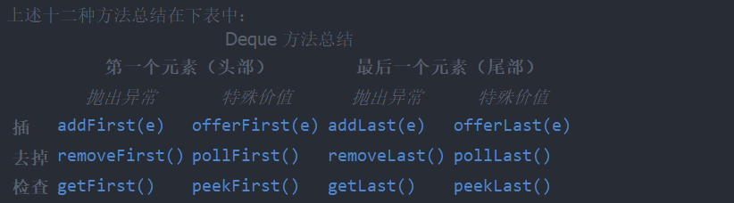

## 文档目的
1. 复习自己学过的队列
2. 列举队列常见功能
3. 常见使用

API总结可见另一个文档。 [队列API](./队列API学习.md)

## 什么是队列
队列是一种特殊的线性表，特殊之处在于它只允许在表的前端（front）进行删除操作，  
只允许在表的后端（rear）进行插入操作。
进行插入操作的一端被称为队尾。进行删除的一端被称为队头。

### 普通队列
Queue。插入是在队尾，删除是在队头。

### 双端队列
可以在队列的两端进行插入和删除操作。Deque
该接口实现了访问队列两端元素的方法，提供了插入、删除和检查元素的方法。
如果操作失败时，这些方法都以两种形式存在，一种是抛异常，另一种是返回特殊值。

### 阻塞队列
队列为空时候，从里面获取数据会阻塞或者返回一些其他的（取决于你使用什么方法）
队列为满时候，往里面插入数据会阻塞或者返回异常(取决你使用什么方法)

使用put/take方法当队列满、空时可以阻塞。但是如果使用普通方法，无法完成阻塞目的。
offer(e) 与普通方法相似，只不过成功返回true，失败返回false。
offer(e, timeout)，会等待一个时间。

poll() 与普通方法相似，成功会返回值，如无值会返回null
poll(timeout) 会等待一个时间
draintTo() 一次获取所有可以获取的数据。
